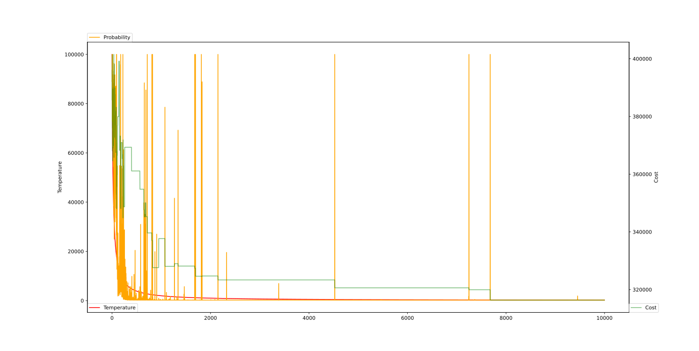

# Vehicle Routing Problem (with Pickups and Deliveries)

Algoritmus: Simulated Annealing

Molnár Balázs (KFIXBJ)

## Választott nyelv és könyvtárak

Választott nyelv: Python

Felhasznált könyvtárak:
- `matplotlib` - vonaldiagram rajzolásához

## Megoldás lépései

### 1. Probléma generálása seed alapján

A VRPPD problémák generálását seed-hez kötötten oldottam meg. A generálást kiszerveztem a `vehicle_routing` modulba, azon belül a `VRPPD` osztályba. A generáláshoz a Python beépített `random` modulját használtam.

A probléma generálása két lépésből áll:
- a városok generálásából,
- majd a kiszállítások generálásából.

A probléma generálásához megadhatók a `random_seed`, `num_of_cities` és `num_of_vehicles` paraméterek.

A generálás reprodukálhatóságának eléréséhez előállítunk egy `random.Random` objektumot a megadott `random_seed` alapján, amelyet a `VRPPD` objektum tárol.

A városok generálása úgy történik, hogy kiválasztunk egyedi `x` és `y` koordináta párokat a `num_of_cites` paraméterből a `grid_size` függvénnyel számított méret alatt. Ezek adják meg a városok helyeit a koordinátarendszerben. A kiválasztás a `Random.randrange` metódussal történik.

A `num_of_cities` paraméternek csak páros értéket engedünk meg, hogy maradék nélkül felosztható legyen kiszállításokra. A kiszállítások generálása úgy történik, hogy kiválasztunk egy véletlen permutációt az indexekből a `Random.sample` metódussal és kettesével eltároljuk őket, mint kiszállítások.

### 2. Lokális keresés megvalósítása

A kereséshez létrehoztam segédfüggvényeket:
- A `vehicle_routing` modulban a `generate_routes`, `city_2_opt` és `route_2_opt` függvényeket, amelyeket egy véletlen megoldás előállításához, illetve a városok útvonalakon belüli és útvonalak közötti 2-opt cseréjéhez lehet használni.
- A `search_utils` modulban a `manhattan_distance` és `euclidean_distance` függvényeket, amelyeket a költség számításánál használtam fel.

A költség kiszámításához a `vehicle_routing` modulban létrehoztam a `Cost` osztályt, amely a `cities` és `distance_func` paraméterekkel példányosítható és meg tudja határozni egy útvonal és egy teljes megoldás költségét, illetve össze tud hasonlítani két megoldást költség szerint.

A lokális keresés esetében egy ciklusban fix iteráció szám eléréséig végeztem 2-opt cseréket útvonalakon belül és útvonalak között és minden iterációban csak jobb eredményt (kisebb költséget) fogadtam el.

A kereséshez a városokból egy olyan gráfot képezünk, ahol a csomópontok a városok helyett az egyes kiszállítások.

A kiválasztott útvonalakat és költségüket a `print_routes` függvénnyel írattam a konzolra.

A keresés paramétereit hard-code-olva lehetett megadni a program elején konstansok formájában.

### 3. Lokális keresés átalakítása szimulált hűtésre

A szimulált hűtés esetén a lokális keresést kibővítjük azzal, hogy egy csökkenő hőmérséklet-függvénytől és a javulás mértékétől függően rosszabb eredményt is elfogadunk.

A hűtéshez szükséges kódot egy külön `simulated_annealing` modulba írtam. Az innen felhasznált osztály a `SimulatedAnnealing`, amely paraméterként elfogad egy cooling strategy függvényt, amely a `CoolingStrategy` osztály megfelelő metódusával állítható elő (a stratégiának megfelelő paraméterek átadásával), illetve egy kezdeti költséget.

A lokális keresésnél használt `for` ciklust átalakítottam úgy, hogy a `SimulatedAnnealing.should_accept` metódus alapján fogadja el az adott megoldást és az erdeményt egy külön változóban tárolom, ami továbbra is csak akkor íródik át, ha nála kisebb költségű megoldást találunk.

A `SimulatedAnnealing` az elfogadási valószínűséget a képletnek megfelelően az iterációval csökkenő `temperature`, illetve a `least_cost` és `current_cost` alapján számítja ki.

A paraméterezés továbbra is konstansok segítségével történik.

### 4. A hűtés menetének ábrázolása `matplotlib` segítségével

A gráf rajzolásához a `matplotlib` könyvtárat használtam. A szimuláció során a `GRAPH_INTERVAL` paraméternek megfelelő gyakorisággal felveszek adatpontokat egy listába, melyeket vonaldiagramon ábrázolok. Az ábrázolt értékek a hőmérséklet, elfogadási valószínűség és a költség.

## Eredmény

